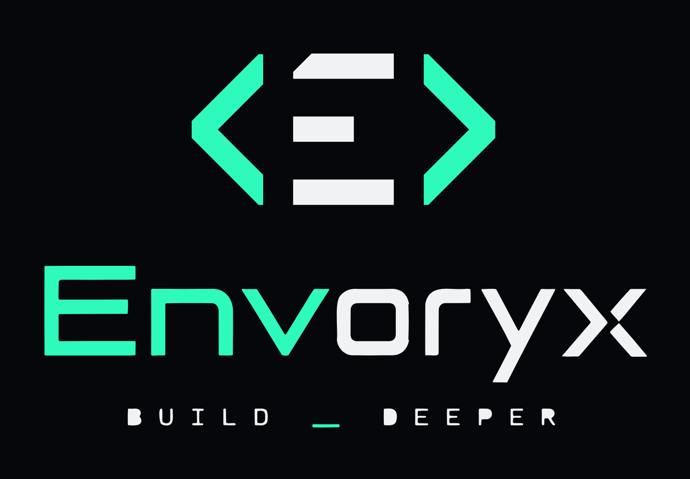

<p align="center">
  
</p>

# Envoryx

**Docker-native development environments for Unraid and Linux servers.**

Envoryx runs as a single container on any Linux Docker host (x86_64 or
arm64; Unraid is the primary target) and manages complete
development stacks – web server, PHP, Python and/or Node.js runtime, database, cache –
as isolated, per-project Docker environments. Everything is controlled from a modern web UI;
no `docker-compose.yml` editing required.

```
Open Envoryx → Create project → PHP 8.4 + Caddy → Create → project is running
Create project → Runtime: Node.js → Vite/Next.js/Nuxt template → Create → https://<project>.test (dev server with HMR)
Create project → Runtime: Python → Django/Flask/FastAPI template → Create → https://<project>.test (uvicorn / runserver with reload)
```

## Status

Envoryx is under active development. The current milestone (Phase 1 + 2) delivers:

- single-container deployment with embedded web UI (Go + React); interface in
  English, German, French, Spanish, Italian, Dutch, Polish, Portuguese, Russian
  and Ukrainian (more languages are one JSON file each)
- local admin account, secure sessions, audit log
- Docker engine integration that only ever touches resources labelled `envoryx.managed=true`
- project templates: Laravel, Symfony (skeleton + webapp), WordPress (PHP),
  Vite + React, Next.js, Nuxt (Node.js) and Django, Flask, FastAPI (Python) –
  scaffolded in a one-shot container
  from the project's runtime image as the project owner, wired to the project
  database where the framework needs one
- project wizard: name, directory, runtime (PHP application, Python
  application, Node.js application or static site – PHP is optional, Python,
  Node-only and static projects work without it), document root, PHP version, php.ini settings and
  extensions (pdo_mysql, mysqli, pdo_pgsql, mongodb, gd, intl, zip, bcmath,
  opcache, imagick), Xdebug switch with IDE setup hints, web server (Caddy,
  Apache or Nginx), SPA fallback for static sites, environment variables
  (with `.env` import and export),
  plan preview
- per-project Docker network with a web server container – Caddy (default),
  Apache (with `.htaccess` support) or Nginx, switchable after creation – and,
  optionally, a PHP-FPM container (Envoryx image with Composer), a Python
  container and/or a Node.js container
- MariaDB, MySQL, PostgreSQL or MongoDB per project: persistent volume, generated
  credentials, connection variables injected into the application containers
  (PHP, Python, Node), optional host port for
  desktop clients, password rotation, create/drop databases, in-place version
  upgrades where the server supports them
- Redis (persistent volume, `REDIS_URL`), Memcached (`MEMCACHED_HOST`/`MEMCACHED_PORT`/`MEMCACHED_URL`), Mailpit (SMTP catcher with web
  inbox, `MAIL_*`/`MAILER_DSN`/`SMTP_HOST`/`SMTP_PORT`), RabbitMQ (message
  broker with management UI, generated login, `RABBITMQ_*`/`RABBITMQ_URL`),
  Meilisearch (search engine with web dashboard, generated master key,
  `MEILISEARCH_*`), Typesense (search engine, generated API key, `TYPESENSE_*`),
  OpenSearch (Elasticsearch-compatible single node without login, `OPENSEARCH_*`,
  optionally with OpenSearch Dashboards)
  and S3-compatible object storage (RustFS: a
  bucket per project, web console, `S3_*`/`AWS_*` injected, reachable from the
  browser for presigned URLs) as optional services
- project files bind-mounted from `/projects/<name>` on the host
- projects reachable at `http://<host>:<port>` (port auto-assigned) and,
  through the embedded reverse proxy, as `https://<project>.test` plus any
  additional domains; certificates from a local CA (download once, trust on
  your devices), or a Let's Encrypt wildcard for your own domain obtained
  and renewed automatically via DNS challenge (Cloudflare, Hetzner, netcup,
  Amazon Route 53, DigitalOcean, Porkbun) – nothing to install anywhere
- start / stop / restart / edit / delete with confirmation
- CPU, memory and process limits per project (application containers and
  services separately), applied live; containers that run out of memory
  show up as a warning and a notification
- application health checks: a path like `/health` must answer with the
  expected status; a notification when the app goes down and when it is back
- resource history per project: CPU, memory, network, disk I/O and disk space
  (volumes, project directory, backups) as charts from one hour to one year,
  plus a dashboard overview of which project uses what
- rename a project after the fact: the identifier follows the name, and with it the
  URL and host names, the container, network and volume names, the SSH users, the
  project directory, the backups and – optionally – the database, its login and the
  bucket. Containers are recreated, the data moves with them
- import an existing website: upload a ZIP/tar.gz of its files and a SQL dump;
  Envoryx recognises WordPress, Laravel, Symfony, Drupal, TYPO3, Joomla and plain
  PHP or HTML sites, suggests PHP version, document root, web server and
  database, wires the site's configuration to the project database and imports
  the dump (also `envoryx import ./site --db dump.sql`)
- duplicate a project (`shop` → `shop-test`) in one dialog: configuration,
  environment, workers, cron jobs and repository binding, plus – each optional – the
  project files, the contents of the database and the objects of the bucket.
  The copy gets its own directory, host ports and containers but keeps the
  original's database credentials, so a `.env` in the project files keeps
  working
- logs per container: live over WebSocket (pause, search, level filter) and a
  persistent history that survives restarted and recreated containers – time
  range, search, error frequency chart, the most frequent errors grouped and a
  download of everything that matches; retention by days and size
- browser terminal (xterm.js) into any project container; application
  containers run the shell as the project owner (PUID/PGID)
- Node.js runtime container per project (npm, pnpm, yarn via corepack),
  version selectable, addable later – as the toolchain next to PHP or as the
  application runtime of a Node-only project. Dev-server mode (Vite, Next.js,
  Nuxt, …) runs `npm run dev` as the container's main process: without PHP
  the project URL `https://<project>.<base>` itself reaches the dev server
  (with HMR); next to PHP it is `https://<project>-dev.<base>`
- Python runtime container per project (pip, uv, venv – the project's
  `.venv` is first on `PATH`), version selectable, addable later – as a
  tooling container or as the application runtime: server mode runs Django
  (`manage.py runserver` / gunicorn), Flask, FastAPI and any ASGI app
  (uvicorn) or WSGI app (gunicorn) as the container's main process, and
  without PHP the project URL reaches it; optional debugpy port for PyCharm
  and VS Code
- Git: clone in the wizard (HTTPS with access token or SSH with a Envoryx
  deploy key), pull, branch switch, status – all inside short-lived containers
  as the project owner; the deploy key is never mounted into app containers
- workers per project: Laravel scheduler / queue worker / Horizon / Reverb,
  Symfony Messenger and Scheduler, PHP and composer scripts, npm and Node
  scripts, Python scripts and modules, Django management commands, Celery
  worker and beat – each in its own auto-restarting container from the
  runtime's image, with logs
- cron jobs per project: any shell command on a schedule (every few minutes,
  hourly, daily, weekly, monthly or a cron expression) in the PHP, Python or
  Node.js container as the project owner, with a timeout, no overlapping runs,
  "run now", the last 20 runs with their output and a notification on failure
- project actions: composer install/update, artisan migrate/seed/cache,
  Symfony console, npm/pnpm/yarn, pip install / uv sync, Django migrate /
  collectstatic – a fixed catalogue of argv
  commands with live output, run in the matching runtime container and shown
  only for the runtimes and files the project has
- desired-state reconciliation on startup and periodically; orphan detection and cleanup
- diagnostics view of all Docker resources (foreign containers read-only)

- several databases per project: next to the primary (host `database`,
  `DB_*`) any number of named ones – PostgreSQL for reporting next to MariaDB,
  say – each in its own container with its own volume and credentials, reached
  by its name as host and injecting `<NAME>_DB_*` and `<NAME>_DATABASE_URL`;
  backups, snapshots, cloning, duplicating, renaming, Adminer, `envoryx.yml`,
  CLI and MCP handle every one of them
- test runner: PHPUnit/Pest, npm test scripts, Playwright, Cypress, pytest and Django
  found in the project and run from the *Tests* tab with live output, a filter, the
  failed tests read from the JUnit report and a history of runs
- shared package cache: Composer, npm, Yarn, pip and uv download a package once for
  all projects (templates included); size and clearing under *Settings → Tools*
- database snapshots: a dump of the database alone, taken before a migration
  and put back with one click (the project need not be running), the ten newest
  kept per project – and cloning one project's database into another's, piped
  straight from container to container, with a snapshot of the target first
- backups per project: database dump + project files (optionally without
  vendor/, node_modules/ and framework build caches) + configuration, stored under `/config/backups` or an
  optional separate `/backups` mount (e.g. on the Unraid array),
  restore with typed confirmation, download as a single archive; daily/weekly
  schedules with retention per project
- instance backups: Envoryx's own database, CA, SSH keys and configuration as
  one downloadable archive – taken automatically before every schema upgrade,
  restorable (or importable on another host) from the settings with an in-place
  restart
- offsite backups to S3-compatible storage (AWS, Backblaze B2, Wasabi, Hetzner,
  Cloudflare R2, MinIO), SFTP (Hetzner Storage Box, NAS) or WebDAV (Nextcloud):
  scheduled project backups and a daily instance backup go up by themselves,
  optionally encrypted with age, with their own retention on the target;
  fetching a copy back – for one project or a whole instance after losing the
  host – is a click

- database browser: optional Adminer container shared by all projects,
  started on first use, opened from the Database tab already logged in,
  served under the Envoryx UI so the session protects it
- IDE integration: embedded SSH server for PhpStorm/WebStorm/VS Code remote
  interpreters and SFTP into project containers (API token or public key) – open
  a project in the IDE as an SFTP deployment, no network share needed;
  the user `<project>` lands in the application container (PHP, else
  Python, else Node), `<project>.php` / `<project>.python` / `<project>.node`
  pick one explicitly; an IDE tab with Xdebug server/path mapping,
  `.idea/php.xml`, Node inspector and debugpy details, JDBC URLs;
  optional JetBrains Gateway support (backend in the container, shared cache)
- notifications (ntfy, Discord, Slack, Telegram, e-mail, generic webhook) for
  unhealthy projects (and their recovery), failed project creation, failed
  backups and certificate renewals – throttled, secrets never returned
- MCP server for AI assistants (Claude Code, Cursor, …): create, duplicate,
  rename, start, stop and inspect projects, read logs, run actions, create
  databases, backups and database snapshots – authenticated with personal API
  tokens, same validation and audit trail as the UI, no destructive tools
- command line for SSH sessions, cron jobs and CI: `envoryx project
  list/show/create/duplicate/rename/start/stop/logs/exec/run`, `envoryx backup …`,
  `envoryx db snapshot|snapshots|restore|clone`, `envoryx git …` and `envoryx
  import`. The binary
  is its own client – it speaks the same REST API with the same API tokens, so a
  token's scope and project restriction apply unchanged, and `envoryx project
  exec` hands the command's exit code back to the calling shell
- project manifest: `envoryx.yml` in the repository describes runtimes,
  services, domains, environment, workers and cron jobs; `git clone` and
  `envoryx up` bring the same environment up again, the Git tab exports the
  file and applies a changed one after a pull

All phases of the original plan are implemented – see
[ARCHITECTURE.md](ARCHITECTURE.md) §13. Releases are listed in
[CHANGELOG.md](CHANGELOG.md); `:latest` is the newest release, `:main` the
development branch.

## Quick start

```yaml
services:
  envoryx:
    image: ghcr.io/envoryx/envoryx:latest
    container_name: envoryx
    ports:
      - "8787:8787"
    volumes:
      - /var/run/docker.sock:/var/run/docker.sock
      - /mnt/user/appdata/envoryx:/config
      - /mnt/user/development:/projects
    environment:
      PUID: 99
      PGID: 100
    restart: unless-stopped
```

Open `http://<server>:8787`, create the admin account, click **New project**.

### Unraid

Install the template once from the Unraid terminal (or via SSH) – it lands on
the flash drive next to your other user templates:

```sh
wget -O /boot/config/plugins/dockerMan/templates-user/my-Envoryx.xml \
  https://raw.githubusercontent.com/envoryx/envoryx/main/deploy/unraid/envoryx.xml
```

Then go to **Docker → Add Container**, pick **Envoryx** under *User
templates* and click **Apply** – ports, `/config`, `/projects`, the Docker
socket and `PUID`/`PGID` are pre-filled. Create the `development` share first
if it does not exist yet. Keep the file name `my-Envoryx.xml` and download it
only once – Unraid stores your container settings in it, and a second copy
under another name would make *Edit*/*Update* fall back to the defaults (see
[DEPLOYMENT.md](DEPLOYMENT.md)). Open `http://<unraid-ip>:8787` and create the
admin account.

For domains and HTTPS (`https://shop.test`) map the proxy ports 80/443 (bridge)
or give the container its own IP on `br0` – see
[Domains and HTTPS](DEPLOYMENT.md#domains-and-https).

Details, environment variables and Unraid notes: [DEPLOYMENT.md](DEPLOYMENT.md).

## How it works

```
Browser ──▶ Envoryx (Go API + React UI) ──▶ Docker Engine
                                             ├── envoryx-<project>      (network)
                                             ├── envoryx-<project>-web  (Caddy/Apache/Nginx, :port → 80)
                                             ├── envoryx-<project>-php    (PHP-FPM, optional)
                                             ├── envoryx-<project>-python (Python / application server, optional)
                                             └── envoryx-<project>-node   (Node.js / dev server, optional)
```

- The web server is part of every project. With PHP it passes requests to
  PHP-FPM; without PHP it serves the document root statically (optionally with
  an SPA fallback to `index.html`). When a project has no PHP but a Python
  application server or a Node dev server, the embedded proxy routes
  `<project>.<base>` straight to that container instead, and the web
  container's host port stays unpublished until the server is turned off.

- Envoryx stores the *desired state* of each project in SQLite (`/config/envoryx.db`).
- The Docker engine holds the *actual state*. Envoryx reconciles both, never trusting
  the database alone – restarting or updating Envoryx never loses projects.
- Every resource Envoryx creates carries `envoryx.managed=true` and
  `envoryx.project.id=<uuid>`. Envoryx refuses to modify anything else.

## Command line

The same binary that runs the server is the client. On the host:

```sh
docker exec -it envoryx envoryx project list
docker exec -it envoryx envoryx project exec shop -- php artisan migrate --force
```

From anywhere else, once per machine:

```sh
envoryx login --url https://envoryx.example.com   # asks for an API token
envoryx project create "Shop" --php 8.4 --database mariadb --template laravel --start
envoryx project logs shop --follow
envoryx backup create shop --note "before the upgrade"
envoryx db snapshot shop --note "before the migration"
envoryx up                                          # in a clone: envoryx.yml → project
```

Commands exit 0/1/2, `exec` passes the command's own exit code on, and `--json`
hands the API's answer to `jq`. See
[DEPLOYMENT.md → Command line](DEPLOYMENT.md#command-line).

## Documentation

| Document | Content |
|----------|---------|
| [ARCHITECTURE.md](ARCHITECTURE.md) | design, data model, lifecycle, phases |
| [SECURITY.md](SECURITY.md) | threat model, Docker socket, hardening |
| [DEPLOYMENT.md](DEPLOYMENT.md) | Docker / Unraid deployment, configuration |
| [DEVELOPMENT.md](DEVELOPMENT.md) | building, running and testing locally |
| [CONTRIBUTING.md](CONTRIBUTING.md) | how to contribute, Contributor License Agreement |

## License

Envoryx is free software under the **GNU Affero General Public License v3.0**
(AGPL-3.0) – see [LICENSE](LICENSE). You may use it freely, also commercially.
If you modify and distribute it, or offer a modified version as a network
service, you must publish your changes under the same license.

Copyright (c) 2026 Stefan Mertens

The projects you run *inside* Envoryx are not affected by this license.

Contributions require a one-time signature of the
[Contributor License Agreement](CLA.md) – see
[CONTRIBUTING.md](CONTRIBUTING.md).
