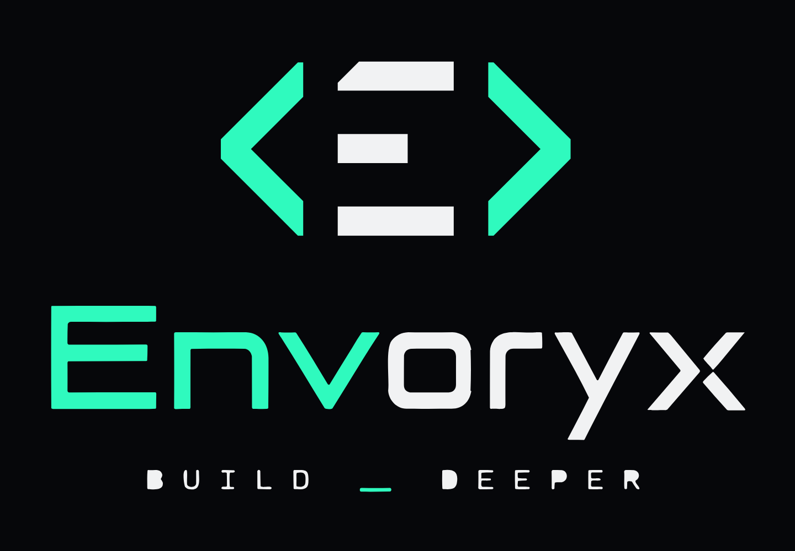

<p align="center">
  
</p>

# Envoryx

**Docker-native development environments for Unraid and Linux servers.**

Envoryx runs as a single container on any Linux Docker host (x86_64 or arm64; Unraid is the
primary target) and gives every project its own development stack: web server, PHP, Python,
Go, Ruby, Java, .NET and/or Node.js runtime, database, cache. Each project lives in its own Docker
environment, and you run all of it from a web UI instead of editing `docker-compose.yml`
files.

```
Open Envoryx → Create project → PHP 8.4 + Caddy → Create → project is running
Create project → Runtime: Node.js → Vite/Next.js/Nuxt template → Create → https://<project>.test (dev server with HMR)
Create project → Runtime: Python → Django/Flask/FastAPI template → Create → https://<project>.test (uvicorn / runserver with reload)
Create project → Runtime: Go → net/http/Gin/Echo template → Create → https://<project>.test (air live reload, Delve)
Create project → Runtime: Ruby → Rails/Sinatra template → Create → https://<project>.test (bin/rails server / Puma, rdbg)
Create project → Runtime: Java → Spring Boot/Quarkus template → Create → https://<project>.test (spring-boot:run / quarkus:dev, JDWP)
Create project → Runtime: .NET → Web API/MVC/Blazor/Razor Pages template → Create → https://<project>.test (dotnet watch, netcoredbg)
```

## What you get

All phases of the original plan are implemented (see [ARCHITECTURE.md](ARCHITECTURE.md)
§13), and Envoryx is still under active development. Releases are listed in
[CHANGELOG.md](CHANGELOG.md); `:latest` is the newest release, `:main` the development
branch.

### The basics

Envoryx is one container with the Go backend and the React UI built in. You get secure
sessions, an audit log and user accounts with roles, and the interface speaks English, German,
French, Spanish, Italian, Dutch, Polish, Portuguese, Russian and Ukrainian (another language
is one JSON file). Envoryx only ever touches Docker resources labelled
`envoryx.managed=true`, so whatever else runs on the host is safe from it.

The first account is an admin. Further users come in through an invitation link and get a
role: viewers look, developers work with projects (start, stop, terminal, actions, git,
backups), admins do everything. A user can have another role in particular projects, and a
project they have no role in stays out of sight. Sign-in works with a password or with
single sign-on through an OpenID Connect provider (Authentik, Keycloak, Authelia, Google …),
whose groups can set the roles.

### Creating a project

The wizard asks for a name, a directory and what the project is: a PHP, Python, Go, Ruby, Java,
.NET or Node.js application, or a static site. PHP is optional; Python, Go, Ruby, Java, .NET,
Node-only and static projects work without it. Then you pick the document root, the PHP version with its
php.ini settings and extensions (pdo_mysql, mysqli, pdo_pgsql, mongodb, gd, intl, zip,
bcmath, opcache, imagick), switch Xdebug on if you want it (with IDE setup hints), choose a
web server (Caddy, Apache or Nginx), an SPA fallback for static sites and your environment
variables (with `.env` import and export). A plan preview shows what will be created before
anything is.

Instead of starting empty you can pick a template: Laravel, Symfony (skeleton + webapp),
WordPress, Drupal, TYPO3, Shopware and Craft CMS for PHP (the CMS installers run from the
Actions tab and print the admin password), Vite + React, Next.js and Nuxt for Node.js,
Django, Flask and FastAPI for Python, net/http, Gin and Echo for Go, Rails, Rails API and
Sinatra for Ruby, Spring Boot and Quarkus for Java, and ASP.NET Core Web API, MVC, Razor
Pages and Blazor for .NET. Envoryx scaffolds them in a one-shot
container from the project's runtime image, as the project owner, and wires them to the
project database where the framework needs one.

You can also import an existing website: upload a ZIP/tar.gz of its files and a SQL dump.
Envoryx recognises WordPress, Laravel, Symfony, Drupal, TYPO3, Joomla and plain PHP or HTML
sites, suggests a PHP version, document root, web server and database, wires the site's
configuration to the project database and imports the dump (on the command line:
`envoryx import ./site --db dump.sql`).

Or you clone a repository in the wizard, over HTTPS with an access token or over SSH with an
Envoryx deploy key. If the repository brings an `envoryx.yml`, that manifest describes
runtimes, services, domains, environment, workers and cron jobs, so `git clone` and
`envoryx up` bring the same environment up again. The Git tab exports the file and applies a
changed one after a pull.

### What runs in a project

Every project gets its own Docker network and a web server container: Caddy (the default),
Apache (with `.htaccess` support) or Nginx, switchable later. Next to it, as needed, come a
PHP-FPM container (the Envoryx image with Composer), a Python, a Go, a Ruby, a Java, a .NET
and/or a Node.js container. Your files are bind-mounted from `/projects/<name>` on the host.

- **Node.js** (npm, pnpm, yarn via corepack) is the toolchain next to PHP or the application
  runtime of a Node-only project. In dev-server mode (Vite, Next.js, Nuxt, …) it runs
  `npm run dev` as the container's main process. Without PHP the project URL
  `https://<project>.<base>` itself reaches the dev server (with HMR); next to PHP it's
  `https://<project>-dev.<base>`.
- **Python** (pip, uv, venv; the project's `.venv` is first on `PATH`) is a tooling container
  or the application runtime. Server mode runs Django (`manage.py runserver` / gunicorn),
  Flask, FastAPI and any ASGI app (uvicorn) or WSGI app (gunicorn) as the main process, and
  without PHP the project URL reaches it. An optional debugpy port is there for PyCharm and
  VS Code.
- **Go** (Go 1.26/1.27 with air, Delve and gotestsum; module and build caches shared by all
  projects) works the same way: server mode builds the main package and runs it, rebuilt by
  air on every change (a project's `.air.toml` wins) or built once in production mode. An
  optional headless Delve serves GoLand and VS Code.
- **Ruby** (Ruby 3.3-4.0 with Bundler and the debug gem; gems in the project home, Bundler's
  download cache shared by all projects) runs Rails (`bin/rails server`, Puma in production
  mode) or any Rack application on Puma (Sinatra, Roda, Hanami), installs the bundle first
  when it's incomplete, and takes the project URL when there's no PHP. Optional `rdbg` works
  with VS Code, and RubyMine uses the SSH remote interpreter.
- **Java** (Eclipse Temurin 17, 21 or 25 with Maven and Gradle; the project's wrapper wins,
  and the Maven and Gradle caches are shared by all projects) runs Spring Boot
  (`spring-boot:run`/`bootRun` with DevTools), Quarkus (`quarkus:dev` with live reload) or any
  jar, builds once and runs the jar in production mode, and takes the project URL when
  there's no PHP. `SPRING_DATASOURCE_*`, `QUARKUS_DATASOURCE_*` and `JDBC_URL` point at the
  project database, and an optional JDWP port serves IntelliJ IDEA and VS Code.
- **.NET** (SDK 10 or 8 with `dotnet-ef`; NuGet packages are shared by all projects) runs
  ASP.NET Core under `dotnet watch` with hot reload, publishes once and runs the DLL in
  production mode, runs any other published application (worker services, console hosts),
  and takes the project URL when there's no PHP. `ConnectionStrings__DefaultConnection`
  points at the project database. There's no debug port: VS Code starts `netcoredbg` in the
  container over SSH, Rider attaches over SSH.

Each runtime's version is selectable, and you can add one to a project later.

### Databases and services

Each project can have MariaDB, MySQL, PostgreSQL or MongoDB with a persistent volume and
generated credentials. The connection variables are injected into the application
containers (PHP, Python, Go, Ruby, Java, Node), and you can publish a host port for desktop
clients, rotate the password, create and drop databases and upgrade the version in place
where the server supports it. Next to the primary (host `database`, `DB_*`) a project can
have any number of named databases, say PostgreSQL for reporting next to MariaDB. Each gets
its own container, volume and credentials, is reached by its name as host and injects
`<NAME>_DB_*` and `<NAME>_DATABASE_URL`; backups, snapshots, cloning, duplicating, renaming,
Adminer, `envoryx.yml`, CLI and MCP handle every one of them. If you already have a
MariaDB, MySQL or PostgreSQL server (or a Redis), a project can connect to that instead,
with a connection test, backups, snapshots and Adminer.

The optional services:

- Redis (persistent volume, `REDIS_URL`)
- Memcached (`MEMCACHED_HOST`/`MEMCACHED_PORT`/`MEMCACHED_URL`)
- Mailpit, an SMTP catcher with a web inbox (`MAIL_*`/`MAILER_DSN`/`SMTP_HOST`/`SMTP_PORT`)
- RabbitMQ with the management UI and a generated login (`RABBITMQ_*`/`RABBITMQ_URL`)
- Meilisearch with its web dashboard and a generated master key (`MEILISEARCH_*`)
- Typesense with a generated API key (`TYPESENSE_*`)
- OpenSearch, an Elasticsearch-compatible single node without login (`OPENSEARCH_*`),
  optionally with OpenSearch Dashboards
- Ollama for local LLMs, with one model store shared by all projects, downloads from the UI
  and an optional NVIDIA GPU (`OLLAMA_HOST`/`OLLAMA_BASE_URL`/`OLLAMA_URL`)
- S3-compatible object storage (RustFS): a bucket per project, a web console, `S3_*`/`AWS_*`
  injected, reachable from the browser for presigned URLs

An optional database browser (an Adminer container shared by all projects) starts on first
use, opens from the Database tab already logged in and is served under the Envoryx UI, so
your session protects it.

### Reaching your projects

A project answers at `http://<host>:<port>` (the port is assigned automatically) and,
through the embedded reverse proxy, at `https://<project>.test` plus any extra domains you
add. The certificates come from a local CA that you download once and trust on your
devices, or from a Let's Encrypt wildcard for your own domain, obtained and renewed
automatically via DNS challenge (Cloudflare, Hetzner, netcup, Amazon Route 53,
DigitalOcean, Porkbun). Then there's nothing to install anywhere.

The proxy also carries per-project rules: allowed addresses, a password (basic auth),
redirects, response headers and CORS, for every host name and for a share. Sharing puts a
project on a temporary public https address through a Cloudflare quick tunnel (no account,
no port forwarding) for up to 24 hours; it ends when the project stops or when you end it.

### Working on a project

You start, stop, restart, edit and delete projects (the last one with confirmation). Logs
come live over WebSocket (pause, search, level filter), and a persistent history survives
restarted and recreated containers: time range, search, an error frequency chart, the most
frequent errors grouped, a download of everything that matches, and retention by days and
size. A browser terminal (xterm.js) opens into any project container; application
containers run the shell as the project owner (PUID/PGID).

Actions are a fixed catalogue of argv commands with live output, run in the matching
runtime container and shown only for the runtimes and files the project has: composer
install/update, artisan migrate/seed/cache, Symfony console, npm/pnpm/yarn, pip install / uv
sync, Django migrate / collectstatic, go build / vet / fmt / mod tidy / generate, bundle
install / update, rails db:prepare / migrate / seed / assets:precompile.

The test runner finds PHPUnit/Pest, npm test scripts, Playwright, Cypress, pytest, Django,
go test, RSpec and `rails test` (against `<database>_test`, never the development database)
in the project and runs them from the *Tests* tab with live output and a filter. It reads
the failed tests from the JUnit report and keeps a history of runs.

Git pull, branch switch and status run in short-lived containers as the project owner; the
deploy key is never mounted into the application containers.

Workers keep long-running commands going, each in its own auto-restarting container from
the runtime's image, with logs: the Laravel scheduler, queue worker, Horizon and Reverb,
Symfony Messenger and Scheduler, PHP and composer scripts, npm and Node scripts, Python
scripts and modules, Django management commands, Celery worker and beat, Go programs of
the module, Solid Queue, GoodJob, Sidekiq, rake tasks and Ruby scripts, jars and Maven or
Gradle goals, and .NET projects or DLLs.

Cron jobs run any shell command on a schedule (every few minutes, hourly, daily, weekly,
monthly or a cron expression) in the PHP, Python, Go, Ruby, Java, .NET or Node.js container as the
project owner, with a timeout and no overlapping runs. You can "run now", see the last 20
runs with their output and get a notification on failure.

Composer, npm, Yarn, pip, uv, Go and Bundler share one package cache, so a package is
downloaded once for all projects (templates included); its size and a way to clear it are
under *Settings → Tools*.

### Changing a project later

You can rename a project after the fact. The identifier follows the name, and with it the
URL and host names, the container, network and volume names, the SSH users, the project
directory, the backups and, if you like, the database, its login and the bucket. The
containers are recreated and the data moves with them.

Duplicating (`shop` → `shop-test`) is one dialog: configuration, environment, workers,
cron jobs and repository binding, plus the project files, the contents of the database and
the objects of the bucket (each of those optional). The copy gets its own directory, host
ports and containers but keeps the original's database credentials, so a `.env` in the
project files keeps working.

Branch environments build on that: pick a branch in the *Branches* tab and you get a copy
of the project on that branch, with the parent's data and its own URL
(`shop-feature-login.test`), deployed with the commands you set once on the parent
(`composer install`, `php artisan migrate --force` …). Switch on *Watch the repository* and
Envoryx asks the remote every few minutes (plain `git ls-remote`, so no webhook and no
public address needed): pushes get deployed, a deleted branch takes its environment with
it, and new branches matching `feature/*` get one on their own. Environments nobody has
opened for a while can stop by themselves.

CPU, memory and process limits apply per project (application containers and services
separately) and take effect right away; a container that runs out of memory shows up as a
warning and a notification. A health check asks a path like `/health` for the expected
status and notifies you when the app goes down and when it's back. The resource history
charts CPU, memory, network, disk I/O and disk space (volumes, project directory, backups)
per project from one hour to one year, and the dashboard shows which project uses what.

### Keeping your data

A database snapshot is a dump of the database alone: take it before a migration and put it
back with one click, even while the project isn't running. The ten newest are kept per
project. You can also clone one project's database into another's, piped straight from
container to container, with a snapshot of the target first.

Project backups hold the database dump, the project files (optionally without vendor/,
node_modules/ and framework build caches) and the configuration. They're stored under
`/config/backups` or on an optional separate `/backups` mount (on the Unraid array, for
example), restored with a typed confirmation and downloadable as a single archive, with
daily/weekly schedules and retention per project.

Instance backups cover Envoryx itself: its database, CA, SSH keys and configuration in one
downloadable archive. One is taken automatically before every schema upgrade, and you can
restore it (or import it on another host) from the settings with an in-place restart.

Offsite backups go to S3-compatible storage (AWS, Backblaze B2, Wasabi, Hetzner, Cloudflare
R2, MinIO), SFTP (Hetzner Storage Box, NAS) or WebDAV (Nextcloud). Scheduled project backups
and a daily instance backup go up on their own, optionally encrypted with age, with their
own retention on the target. Fetching a copy back, for one project or a whole instance after
losing the host, is a click.

### IDEs, assistants and scripts

An embedded SSH server serves PhpStorm/WebStorm/VS Code remote interpreters and SFTP into
project containers (with an API token or your own public key, both limited to your roles),
so you open a project in the IDE as an SFTP deployment without a network share. The user
`<project>` lands in the application container (PHP, else Python, else Go, else Ruby, else
Java, else .NET, else Node);
`<project>.php` / `<project>.python` / `<project>.go` / `<project>.ruby` / `<project>.java` /
`<project>.dotnet` / `<project>.node` pick one explicitly. The IDE tab has the Xdebug server
and path mapping, `.idea/php.xml`, Node inspector, debugpy, Delve, rdbg and JDWP details, a
VS Code `launch.json` for netcoredbg and JDBC URLs, and JetBrains Gateway is optional
(backend in the container, shared cache).

Notifications (ntfy, Discord, Slack, Telegram, e-mail, generic webhook) tell you about
unhealthy projects and their recovery, failed project creation, failed backups and
certificate renewals. They're throttled, and secrets are never returned.

The MCP server lets AI assistants (Claude Code, Cursor, …) create, duplicate, rename,
start, stop and inspect projects, create and deploy branch environments, read logs, run actions and create databases, backups and
database snapshots. It uses personal API tokens with the same validation and audit trail as
the UI, and it has no destructive tools.

For SSH sessions, cron jobs and CI there's a command line: `envoryx project
list/show/create/duplicate/rename/start/stop/logs/exec/run/branches/branch/deploy`,
`envoryx backup …`,
`envoryx db snapshot|snapshots|restore|clone`, `envoryx git …` and `envoryx import`. The
binary is its own client and speaks the same REST API with the same API tokens, so a
token's scope, its project restriction and its owner's roles apply unchanged, and
`envoryx project exec` hands the command's exit code back to the calling shell.

### Behind the scenes

Envoryx reconciles the desired state with Docker on startup and periodically, and it finds
and cleans up orphans. A diagnostics view lists all Docker resources (foreign containers
read-only).

## Quick start

```yaml
services:
  envoryx:
    image: ghcr.io/envoryx/envoryx:latest
    container_name: envoryx
    ports:
      - "8787:8787"
    volumes:
      - /var/run/docker.sock:/var/run/docker.sock
      - /mnt/user/appdata/envoryx:/config
      - /mnt/user/development:/projects
    environment:
      PUID: 99
      PGID: 100
    restart: unless-stopped
```

Open `http://<server>:8787`, create the admin account and click **New project**.

### Unraid

Install the template once from the Unraid terminal (or via SSH). It lands on the flash
drive next to your other user templates:

```sh
wget -O /boot/config/plugins/dockerMan/templates-user/my-Envoryx.xml \
  https://raw.githubusercontent.com/envoryx/envoryx/main/deploy/unraid/envoryx.xml
```

Then go to **Docker → Add Container**, pick **Envoryx** under *User templates* and click
**Apply**. Ports, `/config`, `/projects`, the Docker socket and `PUID`/`PGID` are
pre-filled. Create the `development` share first if it doesn't exist yet. Keep the file name
`my-Envoryx.xml` and download it only once: Unraid stores your container settings in it,
and a second copy under another name would make *Edit*/*Update* fall back to the defaults
(see [DEPLOYMENT.md](DEPLOYMENT.md)). Open `http://<unraid-ip>:8787` and create the admin
account.

For domains and HTTPS (`https://shop.test`), map the proxy ports 80/443 (bridge) or give
the container its own IP on `br0`; see [Domains and HTTPS](DEPLOYMENT.md#domains-and-https).

Details, environment variables and Unraid notes are in [DEPLOYMENT.md](DEPLOYMENT.md).

## How it works

```
Browser ──▶ Envoryx (Go API + React UI) ──▶ Docker Engine
                                             ├── envoryx-<project>      (network)
                                             ├── envoryx-<project>-web  (Caddy/Apache/Nginx, :port → 80)
                                             ├── envoryx-<project>-php    (PHP-FPM, optional)
                                             ├── envoryx-<project>-python (Python / application server, optional)
                                             ├── envoryx-<project>-go     (Go / application server, optional)
                                             ├── envoryx-<project>-ruby   (Ruby / application server, optional)
                                             ├── envoryx-<project>-java   (Java / application server, optional)
                                             ├── envoryx-<project>-dotnet (.NET / application server, optional)
                                             └── envoryx-<project>-node   (Node.js / dev server, optional)
```

The web server is part of every project. With PHP it passes requests to PHP-FPM; without
PHP it serves the document root statically (optionally with an SPA fallback to
`index.html`). When a project has no PHP but a Python, Go, Ruby, Java or .NET application server or a
Node dev server, the embedded proxy routes `<project>.<base>` straight to that container,
and the web container's host port stays unpublished until the server is turned off.

Envoryx stores the *desired state* of each project in SQLite (`/config/envoryx.db`), and the
Docker engine holds the *actual state*. Envoryx reconciles the two and never trusts the
database alone, which is why restarting or updating Envoryx never loses projects. Every
resource it creates carries `envoryx.managed=true` and `envoryx.project.id=<uuid>`, and it
refuses to modify anything else.

## Command line

The same binary that runs the server is the client. On the host:

```sh
docker exec -it envoryx envoryx project list
docker exec -it envoryx envoryx project exec shop -- php artisan migrate --force
```

From anywhere else, once per machine:

```sh
envoryx login --url https://envoryx.example.com   # asks for an API token
envoryx project create "Shop" --php 8.4 --database mariadb --template laravel --start
envoryx project logs shop --follow
envoryx backup create shop --note "before the upgrade"
envoryx db snapshot shop --note "before the migration"
envoryx up                                          # in a clone: envoryx.yml → project
```

Commands exit 0/1/2, `exec` passes the command's own exit code on, and `--json` hands the
API's answer to `jq`. More in [DEPLOYMENT.md → Command line](DEPLOYMENT.md#command-line).

## Documentation

| Document | Content |
|----------|---------|
| [ARCHITECTURE.md](ARCHITECTURE.md) | design, data model, lifecycle, phases |
| [SECURITY.md](SECURITY.md) | threat model, Docker socket, hardening |
| [DEPLOYMENT.md](DEPLOYMENT.md) | Docker / Unraid deployment, configuration |
| [DEVELOPMENT.md](DEVELOPMENT.md) | building, running and testing locally |
| [CONTRIBUTING.md](CONTRIBUTING.md) | how to contribute, Contributor License Agreement |

## License

Envoryx is free software under the **GNU Affero General Public License v3.0** (AGPL-3.0);
see [LICENSE](LICENSE). You may use it freely, also commercially. If you modify and
distribute it, or offer a modified version as a network service, you must publish your
changes under the same license.

Copyright (c) 2026 Stefan Mertens

The projects you run *inside* Envoryx are not affected by this license.

Contributions require a one-time signature of the [Contributor License Agreement](CLA.md);
see [CONTRIBUTING.md](CONTRIBUTING.md).
